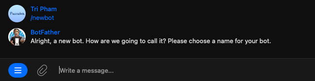
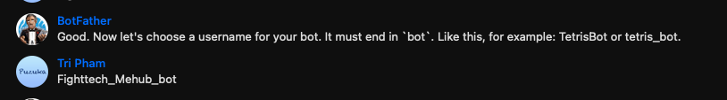
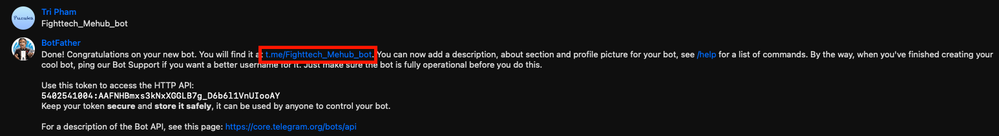
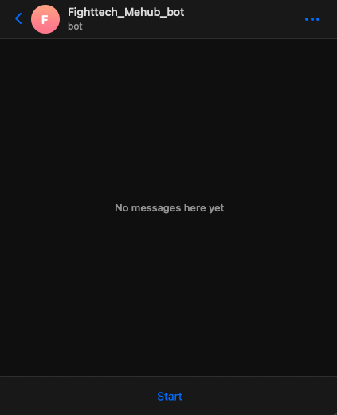
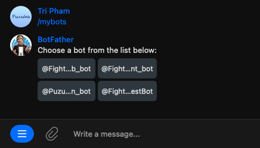
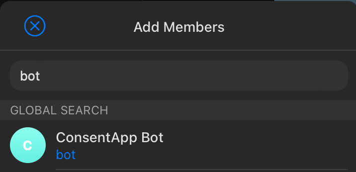
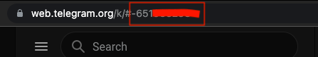
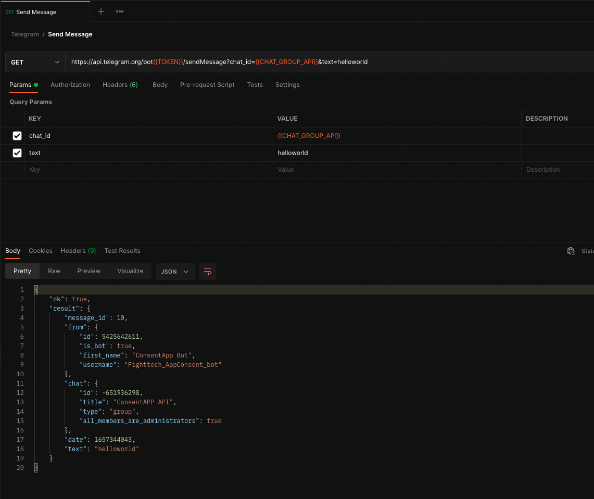

# How to create bot Telegram and use API

## Step 1: Create new bot
- Open telegram -> search "BotFather" and enter message: "/newbot"



## Step 2: Enter bot name



## Step 3: Enter username
- Enter username your bot.  It must end in `bot`. Like this, for example: TetrisBot or tetris_bot.


## Step 4: Start bot
- Open your bot



- Start bot



## Step 5: Get all bot


## Step 6: Open bot setting and get API TOKEN
- Select your bot and choose API TOKEN                                                                                                                                                     


## Step 7: Add bot to group


## Step 8: Get group id


## Step 9: Test send message


## Curl

```
curl --location --request GET 'https://api.telegram.org/bot<API_TOKEN>/sendMessage?chat_id=<GROUP_ID>&text=helloworld'
```